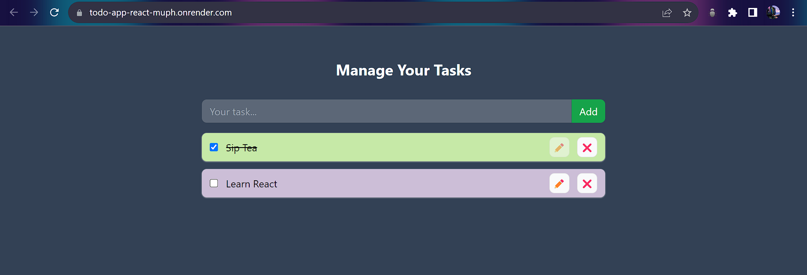
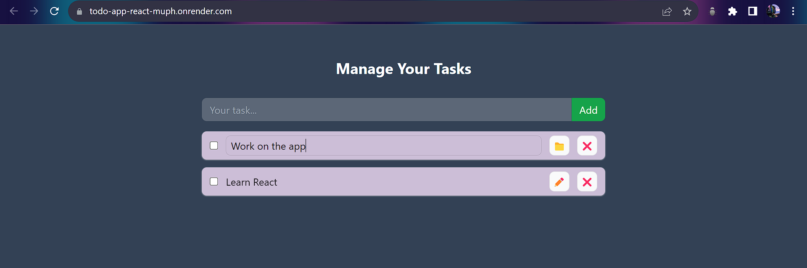

# React Todo App with Context API

A simple Todo app built using React and the Context API for state management.

## Table of Contents

- [Demo](#demo)
    - [Screenshots](#screenshots)
- [Features](#features)
- [Technologies Used](#technologies-used)
- [Running the Project Locally](#running-the-project-locally)

## Demo
You can check out the live demo of the Todo app [here](https://todo-app-react-muph.onrender.com/).

### Screenshots



## Features
- Add new tasks to your to-do list.
- Mark tasks as completed.
- Edit the tasks.
- Remove tasks from your list.
- Store your tasks in browser local storage.
- Efficiently manages state using the Context API.

## Technologies Used
- [React](https://react.dev/)
- [Context API](https://react.dev/learn/passing-data-deeply-with-context)
- Local Storage (browser)
- [TailwindCSS](https://tailwindcss.com/) for styling

## Running the Project Locally
These instructions will help you set up a copy of the project on your local machine.

### Prerequisites
Before getting started, make sure you have Node.js and npm (Node Package Manager) installed on your machine.

### Installing
1. Clone the repository to your local machine:

    ```bash
    git clone https://github.com/Krishnanand2517/todo-react.git
    ```
1. Navigate to the project directory:
    ```bash
    cd todo-react
    ```

1. Install the project dependencies:
    ```bash
    npm install
    ```

### Usage
Once you have installed the project and its dependencies, you can run the development server:
```bash
npm run dev
```

This will start the development server, and you can access the app in your web browser at http://localhost:5173/.